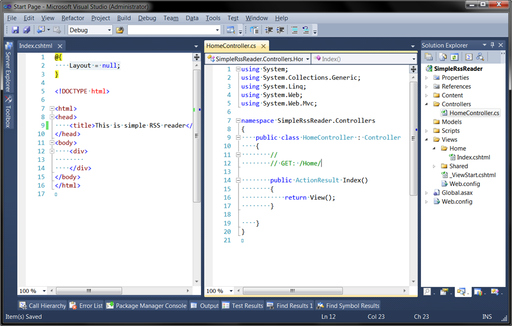
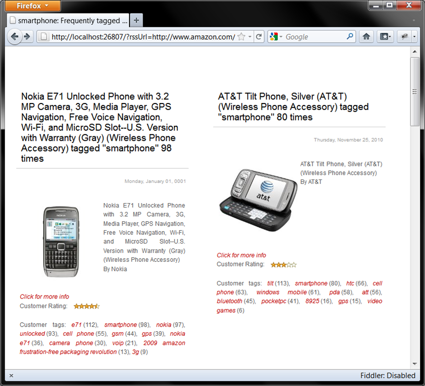

In this article I'll create simple web application using Microsoft Asp.Net MVC framework. The main functionality is to read RSS feed and show feed contents in simple HTML view.<!--cut-->

## Step 1. Create Empty MVC Application.

First of all use Visual Studio menu "File/New project..." then select Asp.Net MVC3 application template and select "Empty" option. We don't need all this standard stuff, this simple application will be created from scratch.

Then, let's create Home controller with action Index and simple View (using Razor engine).



Just hit F5 and ensure that browser opens with our empty page titled "Simple RSS Reader". This is already working Asp.net application; we just need to add functionality to read, parse and show RSS feed. Fast searching in internet shows that there is a great open-source library for .NET named Argotic http://argotic.codeplex.com/. Let's try it and find out how really helpful it is to use 3rd party libraries. Ok, let's move.

## Step 2. Use Argotic Syndication Framework.

On the main site of Argotic you can download installation package with full sources, binaries and documentation. Then, you may traditionally copy required binaries to lib folder of your application, then add references, then make changes in Web.config file and/or every place required by component. But in this case I will use NuGet http://nuget.codeplex.com/. Thankfully it was already registered Argotic.Web package in the repository, and I will add it from "Manage Nuget Packages" tool dialog (This dialog can be found in Visual Studio main menu "Tools/Library Package Manages/ ").


Hit Install button, and wait some time while NuGet downloads packages and makes changes in configuration files.

Then, after reading some very helpful [documentation](http://argotic.codeplex.com/wikipage?title=Consuming%20an%20Atom%20feed%20or%20Atom%20entry%20document) I was able to create RssReaderService class that serves a feed content model to controller. All 3rd-party invocations are used inside this class.

The model:

``` csharp
public class RssArticle
{
	public Uri Link { get; set; }

	public DateTime PublicationDate { get; set; }

	public string Content { get; set; }

	public string Title { get; set; }

	public string Author { get; set; }
}

public class RssFeedContent
{
	public string FeedTitle { get; set; }

	public IEnumerable<RssArticle> Articles { get; set; }
}
```

And here goes the service:

``` csharp
public class RssReaderService: IRssReaderService
{
	public RssReaderService()
	{
	}

	public RssFeedContent ReadFeed(string feedUrl, int numberOfItems)
	{
		var settings = new SyndicationResourceLoadSettings
		{
			RetrievalLimit = numberOfItems
		};
		var feed = GenericSyndicationFeed.Create(new Uri(feedUrl), settings);

		if (feed.Resource is RssFeed)
		{
			return ReadRssFeed((RssFeed)feed.Resource);
		}

		if (feed.Resource is AtomFeed)
		{
			return ReadAtomFeed((AtomFeed)feed.Resource);
		}

		throw new InvalidOperationException("Feed has unsupported format");
	}

	private RssFeedContent ReadRssFeed(RssFeed feed)
	{
		var rssContentModel = new RssFeedContent
		{
			FeedTitle = feed.Channel.Title,
			Articles = feed.Channel.Items.Select(item => new RssArticle
			{
				Title = item.Title,
				Content = item.Description,
				PublicationDate = item.PublicationDate,
				Link = item.Link,
				Author = item.Author
			})
		};

		return rssContentModel;
	}

	private RssFeedContent ReadAtomFeed(AtomFeed feed)
	{
		var rssContentModel = new RssFeedContent
		{
			FeedTitle = feed.Title.Content,
			Articles = feed.Entries.Select(item => new RssArticle
			{
				Title = item.Title.Content,
				Content = item.Content.Content,
				PublicationDate = item.PublishedOn,
				Link = item.Links.FirstOrDefault().Uri,
				Author = string.Join(", ", item.Authors.Select(a => a.Name))
			})
		};

		return rssContentModel;
	}
}
```
	
As you can see RssReaderService is able to read RSS and Atom feed formats.

Then, next step is to use our new service from controller and update view to display the feed. So, the controller:
    
``` csharp
public class HomeController : Controller
{
	public ActionResult Index(string rssUrl)
	{
		var rssService = new RssReaderService();
		var model = rssService.ReadFeed(rssUrl, 10);
		return View(model);
	}
}
```

And view:
    
``` csharp
@model SimpleRssReader.Models.RssFeedContent
@{
	Layout = null;
}

<!DOCTYPE html>

<html>
<head>
	<title>@Model.FeedTitle</title>
	<link href="@Url.Content("~/Content/Rss.css")" rel="stylesheet" type="text/css" />
</head>
<body>
	<div id="items">
	<ul>
	@foreach (var rssItem in Model.Articles)
	{
		<li>
			<h2>
				<a href="@rssItem.Link">@rssItem.Title</a>
			</h2>
			<p>
				@rssItem.PublicationDate.ToLongDateString()
				@rssItem.Author
			</p>
			<div>
				@Html.Raw(rssItem.Content)
			</div>
		</li>
	}
	</ul>
	</div>
</body>
</html>
```
	
Also I wrote a little CSS style sheet "Rss.css" to prettify results.

That's all. Now Web application will show top 10 items from RSS feed specified in rssUrl url parameter. For example let's show Amazon feed, my url looks like this: 

```bash
http://localhost:26807/?rssUrl=http://www.amazon.com/rss/tag/smartphone/popular/ref=tag_rsh_hl_erso
```

This is what result page looks like.



The end.