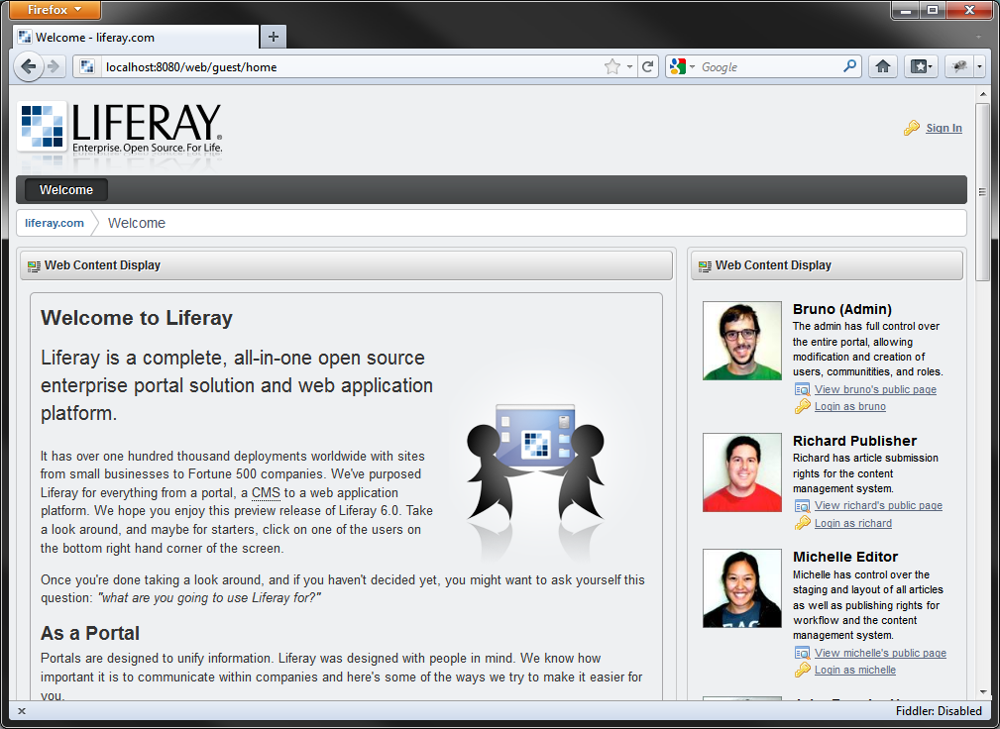
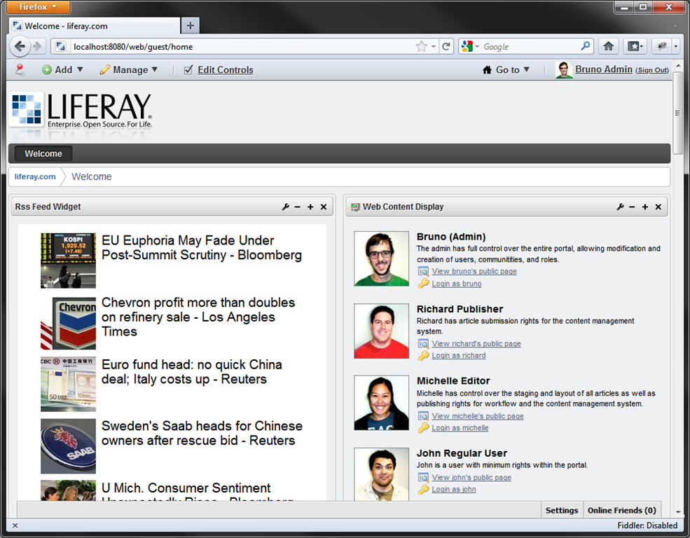
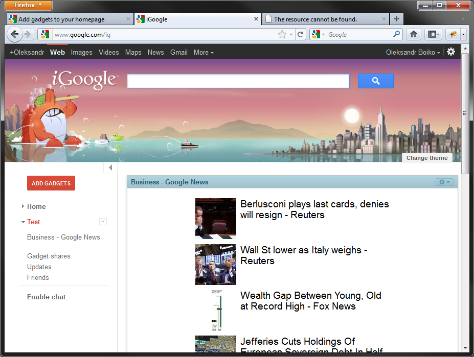

[OpenSocial](http://docs.opensocial.org/display/OS/Home) is a great standard that allows implement Web-gadgets for various web-sites and portals (they are called OpenSocial Containers). Initially developed for Social Networks and driven by Google and [Google gadgets](http://code.google.com/apis/gadgets/) this standart is also becoming popular in corporate web portals sector. Currently such vendors as IBM, SAP, Cisco and many others have support for OpenSocial in theirs corporate products. All this success simply explained by the fact that OpenSocial allows quickly integrate gadgets to various of host portals.

I will use Simple RSS reader Web application that I have created in previous article. I am going to implement OpenSocial integration, so I will able to put my gadget with RSS to any OpenSocial container.

Requirements to gadget:

1. Display list of headlines with images.
2. Loading of Rss content should be performed asynchronously by ajax, so container will not slow down while loading the page.
3. Url of feed and count of displayed items should be configurable by user.

Unfortunately Rss format is not providing any information about image associated with the article. So, I updated RssReaderService a little. Now it scans article content of first  tag and associates that url with article. [There are tons](http://stackoverflow.com/questions/138839/how-do-you-parse-a-html-string-for-image-tags-to-get-at-the-src-information) of different ways to parse contents of HTML. I prefer to use HtmlAgilityPack library that is easy to get through NuGet package manager. I think that XPath is more maintainable than RegEx and this is more important in this case than performance.

Now our service layer is ready, we will go to create UI. (If you are curious about implementation, you can find a link to project sources in the end of article).

## Create UI for widget.

First create new controller action for widget:
``` csharp
public ActionResult Widget(string feedUrl, int topCount)
{
	return View(new RssWidgetModel
	{
		FeedSource = feedUrl,
		TopCount = topCount
	});
}
```
Then create view:

``` csharp
@model SimpleRssReader.Models.RssWidgetModel
@{
	Layout = null;
	var AbsoluteRootUrlPart = Request.Url.GetLeftPart(UriPartial.Authority);
}

<script type="text/javascript" src="http://ajax.googleapis.com/ajax/libs/jquery/1.6.4/jquery.min.js"></script>
<script type="text/javascript" src="@(AbsoluteRootUrlPart + Url.Content("~/Scripts/Views/WidgetHelper.js"))"></script>
<link href="@(AbsoluteRootUrlPart + Url.Content("~/Content/HeadlinesRss.css"))" rel="stylesheet" type="text/css" />

<div id="rss-widget-content">
	<div class="loading-indicator">
		
	</div>
</div>

<script type="text/javascript">

	$(function () {
		var serviceUrl = '@Html.Raw(AbsoluteRootUrlPart + Url.Action("ViewHeadlines"))';

		//Default values
		var gadgetPrefs = {
			feedSource: '@Html.Raw(Model.FeedSource)',
			topCount: '@Model.TopCount'
		};

		var userPrefs = $.widgetHelper.getUserProperties(['feedSource', 'topCount']);
		if (userPrefs != null) {
			$.extend(gadgetPrefs, userPrefs);
		}

		serviceUrl +=
			 "?feedUrl=" + encodeURIComponent(gadgetPrefs.feedSource)
			+ "&topCount=" + encodeURIComponent(gadgetPrefs.topCount);

		$.ajax({
			url: serviceUrl,
			dataType: "jsonp",
			crossDomain: true,
			success: function (data) {
				$('#rss-widget-content').html(data.markup);
				$.widgetHelper.adjustHeight();

				$.widgetHelper.setTitle($("#items").attr('data-title'));
			}
		});

		$('body').bind('imageLoad', function () {
			$.widgetHelper.adjustHeight();
		});
	});
</script>

```
At initial point only loading animation rendered and on documentready event will execute following script actions:

1. Define serviceUrl and default options for gadget in gadgetPrefs object.
2. Load user settings with WidgetHelper.
3. Build url to dynamic Rss content and performing Ajax to query it.
4. On success callback retrieved HTML inserted to DOM instead of loading animation. Also called some integration functions that will implemented later to adjust gadget height and title.
5. Notice that all url's used in view are rendered in absolute scheme. Generally this is not required for widget used in iframe, but for OpenSocial it matters a lot, and there are some reasons for that. Later when our gadget will be integrated to 3rd party container, just open View source in browser and discover how container did rendering job. Scripts and styles will be minimized and combined, and more important all view will be served from containers server. So, for calling ours resources and ajax handlers we need to specify absolute urls.

I included jQuery to perform Ajax and DOM manipulations. Also there is custom script WidgetHelper.js to perform widget manipulation. This is facade for OpenSocial integration and it provides stubs when OpenSocial is not available.

``` javascript
(function ($, undefined) {

	function adjustHeight() {
		if (typeof (gadgets) != 'undefined') {
			gadgets.window.adjustHeight()
		}
	}

	function getUserProperties(propList) {
		if (typeof (gadgets) != 'undefined') {
			var prefs = new gadgets.Prefs();
			var props = {};
			for (var i = 0; i < propList.length; ++i) {
				props[propList[i]] = prefs.getString(propList[i]);
			}
			return props;
		}
		return null;
	}

	function setTitle(newTitle) {
		if (typeof (gadgets) != 'undefined') {
			gadgets.window.setTitle(newTitle);
		}
	}

	$.extend({
		widgetHelper: {
			adjustHeight: adjustHeight,
			getUserProperties: getUserProperties,
			setTitle: setTitle
		}
	});
})(jQuery);
```

In next step create controller action for dynamic Rss content:
    
``` csharp
[JsonpMarkup]
public ActionResult ViewHeadlines(string feedUrl, int topCount)
{
	var rssService = new RssReaderService();
	var model = rssService.ReadFeed(feedUrl, topCount);

	return View(model);
}
```

And view:

``` csharp
@model SimpleRssReader.Models.RssFeedContent
@{
	Layout = null; 
}

<div id="items" data-title="@Model.FeedTitle">
	<ul>
	@foreach (var rssItem in Model.Articles)
	{
		<li>
			<h2>
				<a href="@rssItem.Link" target="_blank">
					@if (!string.IsNullOrEmpty(rssItem.TitleImage))
					{ 
						
					}
					@rssItem.Title
				</a>
			</h2>
		</li>
	}
	</ul>
</div>
```

At this point after compiling and fixing some minor problems there should be available working widget at url like this:
```
 http://localhost/reader/RssReader/Widget?feedUrl=http%3A%2F%2Fnews.google.com%2Fnews%3Ftopic%3Db%26output%3Drss&topCount=10
```

And you should get view like this:


## Create Gadget XML.

OpenSocial Gadget should be described in XML according to specification. To achieve this let's create Controller and View.

Controller code:

``` csharp
using System;
using System.Collections.Generic;
using System.Linq;
using System.Web;
using System.Web.Mvc;
using SimpleRssReader.Models;

namespace SimpleRssReader.Controllers
{
	public class OpenSocialController : Controller
	{
		[HttpGet]
		public ActionResult RssFeedGadget(
			string feed = "http://news.google.com/news?topic=b&output=rss",
			int top = 10)
		{
			ViewBag.FeedSource = feed;
			ViewBag.TopCount = top;
			return View("RssFeedGadget");
		}
	}
}
```

And this is View:
    
``` csharp
@using System;
@{
	Layout = null;
}
<?xml version="1.0" encoding="UTF-8" ?>
<Module>
	<ModulePrefs title="Rss Feed Widget" author="Oleksandr Boiko" author_email="mega.boich@gmail.com" height="160">
		<Require feature="opensocial-0.9" />
		<Require feature="dynamic-height"/>
		<Require feature="settitle"/>
	</ModulePrefs>
	<UserPref name="feedSource" display_name="Feed Source" default_value="http://news.google.com/news?topic=b&amp;output=rss"/>
	<UserPref name="topCount" display_name="Top Count" default_value="10"/>
	<Content type="html">
<![CDATA[
	@Html.Action("Widget", "RssReader", new { feedUrl = ViewBag.FeedSource, topCount = ViewBag.TopCount })
]]>
	</Content>
</Module>
@{
	Response.ContentType = "text/xml";
}
```

This is OpenSocial Gadget Xml, and it contains all information to render gadget in container. Google have good [documentation](http://code.google.com/intl/uk-UA/apis/gadgets/docs/gs.html) about this. In ModulePrefs section located copyright attributes and required features. UserPref sections contains user preferences that will be available to user. Access to this preferences is performed via OpenSocial Javascript API in WidgetHelper.js. Section Content is the container for HTML, CSS, Javascript. Here goes rendering of the Widget action.

So, now you should have a working gadget XML available at url like this: 
```
http://localhost/reader/OpenSocial/RssFeedGadget?feedUrl=http%3A%2F%2Fnews.google.com%2Fnews%3Ftopic%3Db%26output%3Drss&topCount=10
```


## Deploy gadget to container.

[LifeRay](http://www.liferay.com/downloads/liferay-portal/available-releases) portal is a good choice in order to test OpenSocial gadgets. Though it written in Java this product is easy to install and run. You should have Java virtual machine on your test computer in order to run this portal. To install just extract zip archive and run \liferay-portal-6.1.0\tomcat-7.0.21\bin\startup.bat. Then tomcat web server will be run on port 8080 by default with Liferay portal. Looks impressive.




To add our fresh OpenSocial gadget to portal first login to LifeRay under administrator account. There are special quick login links o the main page. Press "Login as Bruno". Then find menu in the top "Add"->"More"->"Install More Applications". Scroll down, find "Open Social" link and click. Page should look similar to this:


Insert url to Rss gadget, press "Save". Okay, now add gadget to the page. To achieve this navigate to main page or whatever page you like and select in top menu "Add"->"More"->"Gadgets"->"Rss Feed Widget". Gadget should be added to page.




Just what we need. Also, in gadget menu there are available option "Configuration".


There are our gadget preferences, and they are managed by Liferay Container. We get access to this values via OpenSocial javascript API in WidgetHelper.js.

Also as a little surprise you can find out that our gadget is fully compatible with iGoogle gadgets, and you can add it to iGoogle page. To perform this you must follow next steps:

1. Deploy your website to hosting that will be accessible by google. I have deployed it to http://apps.megaboich.com/rssreader.
2. Ensure that application deployed correctly and gadget XML is available by public Url.
3. Go to http://www.google.com/ig then login, press "Add gadgets" red button, on the next page in left bottom corner find "Add feed or gadget". Then enter url for your gadget XML and confirm your action.



All sources are available at [BitBucket](https://bitbucket.org/megaboich/simplerssreader).

Enjoy.