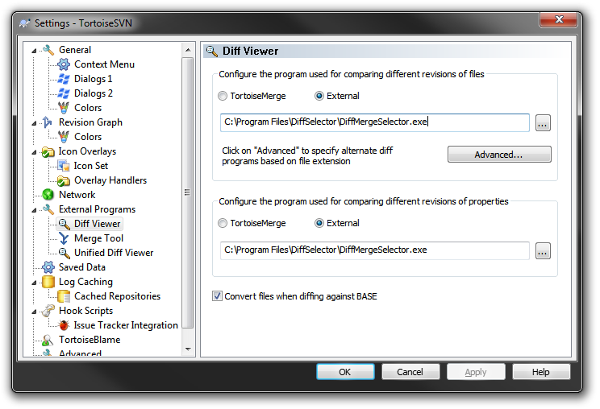
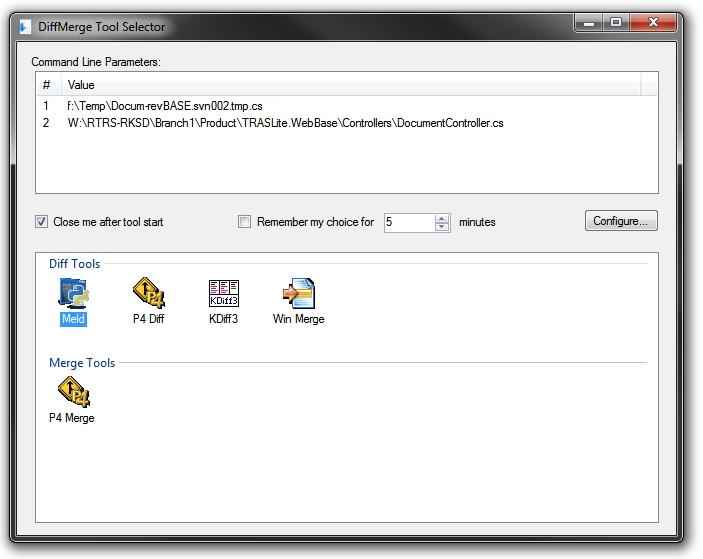

DiffMergeSelector might be a helpful tool in case you have several favorite diff/merge tools. It works like "proxy" between your diff tools and your IDE, SVN, Git, Mercurial or any other development tool.<!--cut-->
For example you can configure Tortoise SVN to use DiffMergeSelector as external merge tool:

Then each time when you launch diff from Tortoise SVN you will get something like this:

All you need is perform double-click on icon. It will launch corresponding Diff Tool with appropriate parameters. This is very helpful when you have to use different merge tools for different files or different tasks, and don't want to reconfigure all your development tools each time.

If you are going to use the same tool for a known timespan you can skip this step of selecting tool each time just use "Remember my choice for N minutes" option. When DiffMergeSelector runs in this time interval it will automatically run last used Diff Tool without asking your opinion. If you want to clear this timespan you can run DiffMergeSelector.exe with "-r" command line, or "reset_last_choice.cmd" which comes in ZIP package.

DiffMergeSelector allows customization of command line for each Diff Tool, for example I was able to easily configure it to run Meld (which by fact is running by Python).

In case you are interested there are source code on [Github](https://github.com/megaboich/DiffMerge-Tool-Selector).