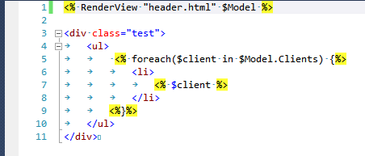

Hi everyone. In this article I want to describe my custom view engine for PowerShell. This one is simple and powerful enough. Here is list of requirements that I had implemented:

1. Views stores separately from code in Html files.
2. Support of nested Views, inline PowerShell code.
3. Using Asp-style separators <%...%>.
4. Works everywhere, only PowerShell 2.0 is required without additional tweaks.

First of all I was trying to find something already implemented, but with bad luck. Someone tries Razor engine, but this is very complicated and requires additional tweaks. Someone indeed implemented their own engines, but with some custom syntax and with poor functionality. So when a bright idea came into my mind I implemented my own view engine.

Here is screenshot of view to use with my engine.


#### Implemetation

When I first was discovering PowerShell I was thrilled by inline string PowerShell evaluation functionality. For example your expression:
    
``` powershell 
$test = "<div> $($env:COMPUTERNAME)</div>" 
```
	
Will be evaluated at runtime to something like this:

``` html
<div>MYCOMPUTER</div>
```

This is indeed very simple View Engine right out of the box. With it you can build complicated template like this:

``` powershell 
$Model = @{}    
$Model.Title = 'Hello, this is a test'
$Model.Clients = @('Ivan', 'Sergiy', 'John')

#view render method 1 - embedded powershell string evaluation
$html = "
<h1>
	$($Model.Title)
</h1>
<div class=""test"">
	<ul>
		$( foreach($client in $Model.Clients) {"
		<li>
			$( $client )
		</li>
		"})
	</ul>
</div>"
Write-Host $html
```

As you can see PowerShell parser is able to distinguish nested language expressions inside $() blocks, and this is extremely useful for implementation of loops and if-then statements.

This method is ready for use for small templates, but it has some cons:

1. View markup is included in code, rather than separate file.
2. Nested views not supported.
3. Syntax is complicated, when you miss ),} or “ it is hard to find where the problem is.
4. You need to encode double quotes.

Ok, first two problems can be solved with next function:

``` powershell 
function RenderViewNativePowerShell(
	[Parameter(Mandatory=$true)][string] $viewName,
	[Parameter(Mandatory=$true)][Object] $model
)
{
	$viewFileName = Resolve-Path ('Views\' + $viewName)
	$templateContent = Get-Content $viewFileName | Out-String
	return $ExecutionContext.InvokeCommand.ExpandString('"' + $templateContent + '"')
}
```

It loads template from file and then uses the PowerShell string evaluation on it. (It was hard to find this function in language reference).

This function can be called this way:

``` powershell 
#view render method 2 - templates powershell evaluation
RenderViewNativePowerShell 'Test_ps.html' $Model
```

It supports nested views, take a look at view ‘test_ps.html’

``` powershell 
$( RenderViewNativePowerShell 'header_ps.html' $Model )

<div class=""test"">
	<ul>
		 $( foreach($client in $Model.Clients) {"
			<li>
				$( $client )
			</li>
		"})
	</ul>
</div>
```

Ok, this is already very useful implementation, but what about using Asp-like <%... %>formatting? This special closures has support in many specialized text editors and very convenient for many people. So, next idea was simply replace Asp <%...%>braces to its PowerShell equivalents $(…). But this was not so simple because PowerShell syntax needs to be different in cases when nested code blocks used.

After some struggling I was able to implement Regex parsing expression and intelligent replace logic. Here it is:

``` powershell 
function RenderView(
	[Parameter(Mandatory=$true)][string] $viewName,
	[Parameter(Mandatory=$true)][Object] $model
)
{
	$viewFileName = Resolve-Path ('Views\' + $viewName)
	$templateContent = Get-Content $viewFileName | Out-String
	
	$rx = New-Object System.Text.RegularExpressions.Regex('(<%.*?%>)', [System.Text.RegularExpressions.RegexOptions]::Singleline)
	$res = @()
	$splitted = $rx.Split($templateContent);
	foreach($part in $splitted)
	{
		if ($part.StartsWith('<%') -and $part.EndsWith('%>')) #transform <%...%> blocks
		{    
			$expr = $part.Substring(2, $part.Length-4) #remove <%%>
			$normExpr = $expr.Replace('`n','').Replace('`r','').Trim();
			
			$startClosure = '$('
			$endClosure = ')'
			if ($normExpr.EndsWith('{')) {
				$endClosure = '"'
			}
			if ($normExpr.StartsWith('}')) {
				$startClosure = '"'
			}
			$res += @($startClosure + $expr + $endClosure)
		}
		else #encode text blocks
		{    
			$expr = $part.Replace('"', '""');
			$res += @($expr)
		}
	}
	$viewExpr = $res -join ''
	return $ExecutionContext.InvokeCommand.ExpandString('"' + $viewExpr + '"')
}
```

This code also replaces " to "", so it is ready for Html views.

Here is screenshot from Visual Studio:




All source code with samples and tests you can find on [GitHub](https://github.com/megaboich/PowerShellViewEngine).
