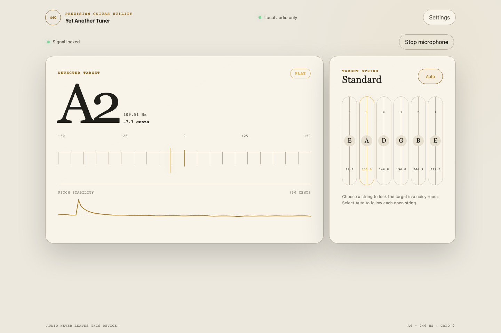
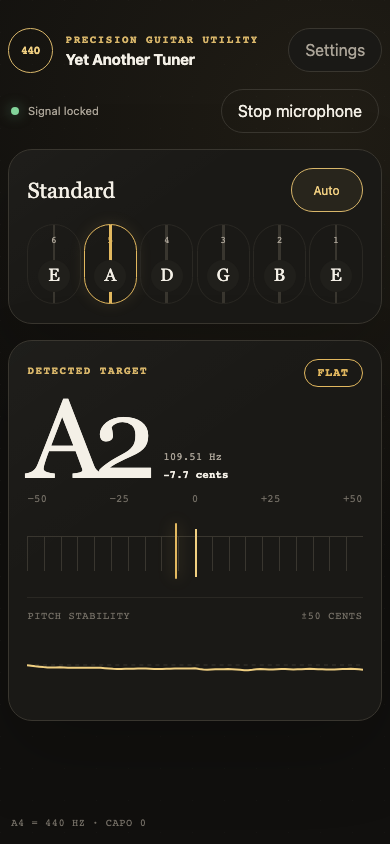

I like playing the guitar from time to time, and every time before playing I need a tuner. Usually it is an app on my phone, and I tried quite a few of them. The story was always the same: a full-screen ad right at the moment when I want to tune, a banner over the needle, or a "Pro" subscription for very basic features. All I wanted is to pluck a string and see if it is flat or sharp.

At the same time I had a lot of interest in Web Audio APIs and wanted to try them on something real. So, when a bright idea came into my mind, I started to write my own tuner. It works directly in web browser, has no ads and no backend, and sound from the microphone never leaves the device.

You can try it here: [olekboiko.com/yet-another-tuner](https://olekboiko.com/yet-another-tuner/).<!--cut-->



Here is a list of requirements that are implemented now:

1. Automatic detection of the string being played, or the possibility to lock one string manually.
2. Tuning meter in cents and a pitch history graph, so it is visible how the note settles.
3. Several tunings: Standard, Drop D, DADGAD, Open G, Open D, half and full step down, or a custom one.
4. A4 calibration, capo, and reference tone.
5. Light and dark themes, and also a left-handed layout.
6. Works offline and can be installed on the phone as an app (PWA).
7. No runtime dependencies, only plain JavaScript. Vite is used just for building.



## Implementation story

This project turned out to be quite long lasting, and it has two quite different parts.

The first part was done in March 2025, all manually by me, in the most straightforward way. For the pitch detection I took the [aubio](https://aubio.org/) library compiled to WebAssembly, and the audio was processed by `ScriptProcessorNode` on the main thread. It worked, but `ScriptProcessorNode` is deprecated, and running audio processing on the same thread with UI is not a great idea. So in April 2025 I moved the processing into an `AudioWorklet` and added the pitch chart.

And that was the point where I had a minimal working prototype. It was showing the note and it was possible to tune the guitar with it, but the itching interest was gone, and I abandoned the project for more than a year.

The second part happened in August 2026. At that time I had some interest in the latest advances in AI assistants, especially in the [GPT-5.6 Sol](https://openai.com/index/gpt-5-6/) model, which was just released in July 2026. Also I wanted to try [OpenCode](https://opencode.ai), an AI coding harness which was new for me. My half-finished tuner looked like a perfect playground for this experiment. So the rest of the app was completed by AI under my guidance: I was explaining what I want, reviewing the results, testing on my guitars and deciding what to do next.

During this second part aubio was replaced with a pitch detector written in plain JavaScript, everything got covered with tests using real guitar recordings, and the app got settings, themes and offline mode. Below are the most interesting technical details.

## Audio graph

Web Audio API works like a graph: you connect audio nodes together, and the browser pushes sound through them. For the tuner the graph is very simple:

```text
microphone -> MediaStreamSource -> AudioWorklet (pitch detection) -> silent gain -> destination
```

First of all it is necessary to ask for the microphone. By default, browsers configure the microphone for voice calls: echo cancellation, noise suppression and automatic gain control. This is great for calls, but for a tuner it only spoils the signal, so all of it should be switched off:

```js
const stream = await navigator.mediaDevices.getUserMedia({
  audio: {
    autoGainControl: false,
    channelCount: 1,
    echoCancellation: false,
    noiseSuppression: false
  }
});
```

The last node in the graph is a gain node with volume `0`. The browser processes the graph only when it is connected to an output, and this silent gain keeps it running without playing the guitar back through the speakers.

## AudioWorklet

`AudioWorklet` is code that runs on the browser's real-time audio thread, separately from the page. It receives the audio in small blocks of 128 samples. The processor itself is quite small:

```js
class TunerPitchProcessor extends AudioWorkletProcessor {
  constructor() {
    super();
    this.pitchDetector = new MpmPitchDetector(sampleRate);
  }

  process(inputs) {
    const channel = inputs[0]?.[0];
    if (channel && this.pitchDetector.push(channel)) {
      this.port.postMessage({
        type: "estimate",
        estimate: {
          frequency: this.pitchDetector.frequency,
          confidence: this.pitchDetector.confidence,
          rms: this.pitchDetector.rms
        }
      });
    }
    return true;
  }
}

registerProcessor("tuner-pitch-processor", TunerPitchProcessor);
```

Only three numbers go back to the page: frequency, clarity and loudness. Raw audio stays inside the worklet.

There is one important thing about the worklet: it has real-time deadlines. If `process()` is too slow, the audio starts to glitch. So the detector is careful with memory. All buffers are typed arrays that are created once and then reused. The ring buffer for samples is "mirrored": each sample is written twice, at index `i` and at `i + windowSize`. This way the latest window of 2048 samples is always one continuous piece of memory and can be read without copying. Also, the analysis does not run on every block of 128 samples, only once per 512 new samples.

One more problem was with deployment. The worklet is loaded by its own URL with `audioWorklet.addModule()`, so it should be a separate file with all its imports included. With a simple Vite `?url` import the file was copied as is, without its imports, and it did not work after deployment. The fix was to import it as `?worker&url`, so Vite bundles the worklet with its dependencies.

## McLeod Pitch Method

The first idea for pitch detection is usually FFT: find the strongest frequency and that's it. Unfortunately with a guitar this does not work well. A plucked string is not a clean sine wave, it is a fundamental frequency plus a lot of harmonics. On the low E string the second harmonic (about 164.8 Hz) is often louder than the fundamental (82.4 Hz), and a naive tuner shows an E one octave higher.

So the new detector implements the **McLeod Pitch Method** (MPM), described in the paper ["A Smarter Way to Find Pitch"](https://www.cs.otago.ac.nz/graphics/Geoff/tartini/papers/A_Smarter_Way_to_Find_Pitch.pdf) by Philip McLeod and Geoff Wyvill. The idea is simple: take the waveform, shift a copy of it to the right, and check how well the two copies match. When the shift is equal to one period of the note, peaks are aligned with peaks. This is calculated by the Normalized Square Difference Function:

```text
NSDF(τ) = 2 × Σ x[j]·x[j+τ] / Σ (x[j]² + x[j+τ]²)
```

The result is between -1 and 1, and a peak close to 1 means a clear repetition. The trick against harmonics is that MPM does not take the highest peak, it takes the *earliest* peak that is at least 85% as high as the best one. Then a small parabolic interpolation around the peak gives a fractional period, and `frequency = sampleRate / period`. This fractional part is really important, because an error of a whole sample can be several cents.

Before the analysis, the signal also goes through a light 80 Hz high-pass filter, which removes rumble and handling noise.

## From frequency to "A, 3 cents flat"

The raw frequency is still quite jumpy, so on the main thread there are a few more steps:

1. Reject windows that are too quiet or not periodic enough.
2. Smooth the value. A short median filter removes single outliers, and then exponential smoothing works in logarithmic frequency, because we hear pitch in ratios, not in hertz.
3. Choose the string. Each string is compared with the measured pitch and with its first harmonics, and fundamentals get a small preference.
4. Stabilize. A new string should win several times in a row before the display switches to it.

The cents are calculated with the usual formula `cents = 1200 × log2(measured / target)`.

The last step was the hardest. The pick attack and the decay of a string can for a short moment look like another string or another octave, and it was visible as a flickering note name.

## Testing with real guitars

Synthetic sine waves are very easy to detect, so unit tests alone were too optimistic. To get real data I recorded each open string on two guitars with Voice Memos on my Mac. One more recording plays all six strings one after another, about three seconds each.

A Playwright browser test plays these recordings through the real worklet and UI, remembers every note change on the screen, and expects exactly this:

```text
E2 -> A2 -> D3 -> G3 -> B3 -> E4
```

Any extra change is a flicker and the test fails. This test indeed caught a real problem: with a stricter peak threshold the detector skipped the fundamental while the string was fading out and showed the wrong octave.

## Offline mode

At last, the tuner is a Progressive Web App. A small Vite plugin generates a list of all built files with a version hash, and a service worker caches them. After the first visit it can be installed on the home screen and works without network at all. When online, the page is loaded from the network first, so new versions still arrive.

## Summary

It was a nice and interesting project. Web Audio API turned out to be very powerful: `getUserMedia`, an `AudioWorklet` and a few typed arrays are enough to build a tuner that works with a real guitar in a real room. And finally I have a tuner without ads.

It was also an interesting experience to finish a project together with an AI assistant. The prototype that I abandoned more than a year ago is now a complete app with tests, settings and offline mode.

If you play guitar, give it a try: [olekboiko.com/yet-another-tuner](https://olekboiko.com/yet-another-tuner/).

In case you are interested, source code is available on [Github](https://github.com/megaboich/yet-another-tuner), and there is also a [detailed description of the pitch analysis](https://github.com/megaboich/yet-another-tuner/blob/main/docs/pitch-analysis.md).
